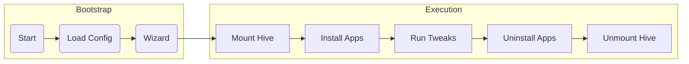

# ZipTie

Zero-dependency Windows 11 system bootstrapping framework for public exhibits, gallery installations, and unattended digital signage.

## What it Does

* **System Settings**: Configures hostname, timezone, high-performance power plan, and daily reboot schedules.
* **Windows Customization**: Disables updates, edge swipes, touch feedback, OOBE prompts, screensavers, and notifications.
* **Package Management**: Installs apps like NVM, git, VS Code, uninstalls bloatware like OneDrive
* **Autologon & Startup**: Configures automatic login and startup tasks.

## One-Line Install

Run from CMD or PowerShell to bootstrap a fresh system:

```powershell
powershell -ExecutionPolicy Bypass -Command "irm https://raw.githubusercontent.com/littlevoid-io/ziptie/main/scripts/bootstrap.ps1 | iex"
```

To pass parameters to the installer:

```powershell
powershell -ExecutionPolicy Bypass -Command "& ([scriptblock]::Create((irm https://raw.githubusercontent.com/littlevoid-io/ziptie/main/scripts/bootstrap.ps1))) -ExtraArgs '-y -d --timezone \"Tokyo Standard Time\" --disableScreensaver false'"
```

## Quick Start

### 1. Install & Build

```powershell
npm install; npm run build
```

### 2. Execution Commands

| Command | Action |
| :--- | :--- |
| `npm start` | Apply configuration (requires elevation) |
| `npm start -- --dry-run` | Preview changes without modifying system state |
| `npm start -- --undo` | Revert applied configuration |
| `npm start -- <overrides>` | Apply with parameter overrides |

Configure settings in `ziptie.config.json`. Schema validation is provided via `ziptie.schema.json`.

## CLI Overrides

Override configuration parameters using command-line arguments:

* **Dot-Notation**: Target nested keys explicitly.
  ```powershell
  npm start -- --windows.disableScreensaver=false --system.computerName="EXHIBIT-99"
  ```
* **Flat Shortcuts**: Omit categories for unique keys. The engine auto-casts values.
  ```powershell
  npm start -- --timezone "Tokyo Standard Time" --disableScreensaver true --apps "Node.js,Git.Git"
  ```
* **Combined Flags**:
  ```powershell
  npm start -- -y -d --computerName "EXHIBIT-02" --windows.disableEdgeSwipes=false
  ```

#### Parameters

<details>
<summary>View all available configuration parameters</summary>

| Key | Type | Description |
| :--- | :--- | :--- |
| `system.computerName` | string | Hostname of the system. |
| `system.timezone` | string | System timezone registry value or `auto`. |
| `system.dailyReboot` | boolean | Configures daily reboot task. |
| `system.rebootTime` | string | Time of reboot (e.g., `06:00`). |
| `system.rebootOnFinish` | boolean | Reboots machine when Ziptie finishes applying. |
| `autologon.enabled` | boolean | Enforces passwordless auto-login for user. (Requires dot-notation) |
| `autologon.username` | string | OS user account targeted for auto-login. |
| `autologon.disablePasswordlessHello` | boolean | Disables Windows Hello passwordless enforcement. |
| `startupTask.enabled` | boolean | Creates a scheduled task running at GUI logon. (Requires dot-notation) |
| `startupTask.workingDir` | string | Directory from which target executable starts. |
| `startupTask.executable` | string | Executable path/name to launch. |
| `startupTask.args` | array | Command line arguments. |
| `startupTask.trigger` | string | Trigger constraint (default: `AtLogon`). |
| `startupTask.delay` | string | Delay before launch (e.g., `PT1M`). |
| `packageManager.provider` | string | Package manager CLI tool (`winget` or `choco`). |
| `packageManager.allowOfflineFallback` | boolean | Searches `.\installers` for silent installers if offline. |
| `packageManager.localInstallersPath` | string | Folder path for local offline installer files. |
| `packageManager.apps` | array | App package IDs or Chocolatey names to install. |
| `windows.disableScreensaver` | boolean | Disables lockscreen, sleep, and screensavers. |
| `windows.disableAccessibilityShortcuts` | boolean | Blocks Shift-key accessibility triggers. |
| `windows.disableEdgeSwipes` | boolean | Disables touch swipes from monitor edges. |
| `windows.disableTouchFeedback` | boolean | Disables visual touch pointer indicators. |
| `windows.disableSystemSounds` | boolean | Disables standard system-event audio alerts. |
| `windows.disableWindowsUpdate` | boolean | Disables Windows Update services and tasks. |
| `windows.disableWindowsWidgets` | boolean | Disables widgets and news feeds from taskbar. |
| `windows.disableCopilotRecall` | boolean | Disables Windows Copilot and Recall tracking. |
| `windows.disableOOBEPrompts` | boolean | Blocks post-update configuration prompt displays. |
| `windows.clearDesktopIcons` | boolean | Removes all default shortcuts from public desktop. |
| `windows.solidColorBackground` | string | Sets desktop to a hex-coded solid color (e.g., `#333333`). |
| `windows.enableDarkMode` | boolean | Forces dark theme across Windows UI. |
| `windows.configureExplorer` | boolean | Displays file extensions, hidden files, and simplifies layout. |
| `windows.disableAppInstalls` | boolean | Blocks Microsoft Store background app provisioning. |
| `windows.disableAppRestore` | boolean | Blocks automatic AppX restoration behavior. |
| `windows.disableErrorReporting` | boolean | Disables Windows error popup reporting. |
| `windows.disableFirewall` | boolean | Disables Windows Defender Firewall rules. |
| `windows.disableMaxPathLength` | boolean | Extends NTFS 260 character directory limits. |
| `windows.disableNewNetworkWindow` | boolean | Disables new overlay network panel flyouts. |
| `windows.disableNotifications` | boolean | Disables standard Windows Action Center toast notifications. |
| `windows.disableTouchGestures` | boolean | Disables multi-finger touch controls. |
| `windows.enableScriptExecution` | boolean | Unlocks local PowerShell execution restrictions. |
| `windows.resetTextScale` | boolean | Forces text size settings back to 100%. |
| `windows.uninstallBloatware` | boolean | Automatically uninstalls bundled bloatware packages. |
| `windows.uninstallOneDrive` | boolean | Completely uninstalls and disables OneDrive. |
| `windows.unpinStartMenuApps` | boolean | Removes pinned default apps from the Start menu. |
| `windows.setPowerSettings` | boolean | Forces system to the Ultimate/High Performance power plan. |

</details>

## Development & Testing

### Local Simulation

To simulate bootstrapping using local assets:

```powershell
powershell -ExecutionPolicy Bypass -File .\scripts\bootstrap.ps1 -InstallDir "C:\ziptie-dev" -ExtraArgs "-d -y"
```

### Test Commands

| Command | Target |
| :--- | :--- |
| `npm test` | Run entire test suite (TypeScript & Pester) |
| `npm run test:unit` | Run TypeScript unit tests |
| `npm run test:cli` | Run CLI integration tests |
| `npm run test:pester` | Run PowerShell Pester unit tests |

### Windows Sandbox Verification

Verify configuration behaviors in an isolated Windows Sandbox:

| Command | Action |
| :--- | :--- |
| `npm run sandbox` | Mount repository to guest Desktop and open interactive guest console |
| `npm run sandbox:local` | Mount repository and run automated guest tests (`test/run-sandbox-tests.ps1`) |
| `npm run sandbox:remote` | Launch clean sandbox and run the remote cloud bootstrap script |

## Releases

1. Configure `GITHUB_TOKEN` in `.env`:
   ```env
   GITHUB_TOKEN=your_token
   ```
2. Build and publish:
   ```powershell
   npm run release
   ```
## Execution Pipeline

1. **Schema Validation**: Parses `ziptie.config.json` against `ziptie.schema.json` and deep-merges with defaults.
2. **Hive Mounting**: Mounts `C:\Users\Default\NTUSER.DAT` to `HKU:\DefaultUser` so future users inherit customized user settings.
3. **App Provisioning**: Scans `./installers` for offline installers or uses `winget`/`choco` fallbacks.
4. **Tweak Execution**: Runs convergent scripts in `scripts/windows/` for apply or revert (`-Undo`) operations.


